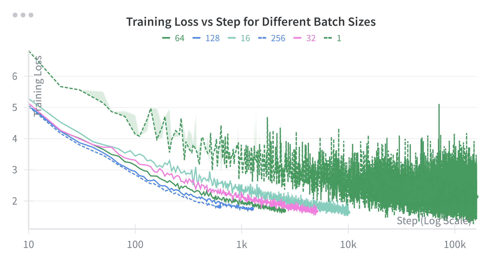
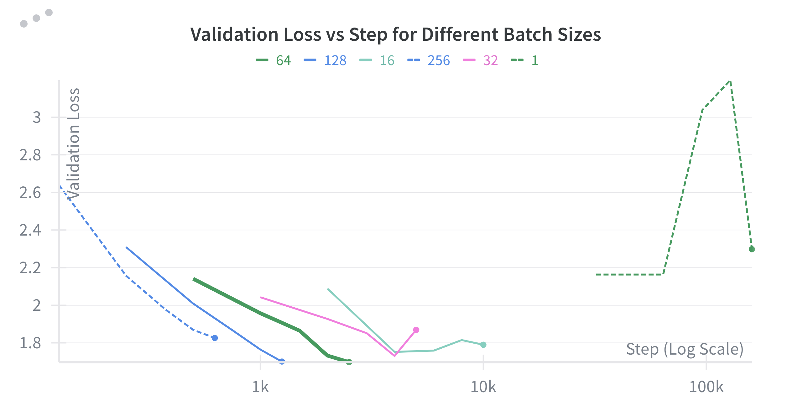

# Problem (`batch_size_experiment`): Batch size variations

This experiments was performed by performing a grid search over different batch sizes, learning  rate and weight decay rate (the possible combinations can be found in [batch_size_sweep.yml](../hyperparam_tuning/batch_size_sweep.yaml)).

Then, for each batch size, we pick the best performing run (i.e., over all lrs and weight-decay rates), and put them together to produce the above plots.

Note that all runs were performed with equal budget (i.e., equal total number of tokens, computed as `steps` x `batch_size` x `context_length`), hence the larger the batch size, the smaller the step size.

As we can observe, generally the larger the batch size, the more accurate the gradient (i.e., closer to true gradient), therefore the faster the decrease in training (and validation) loss. 
However, there is also a tradeoff between batch size and compute budget. 
For some set budget, the number of training steps would be higher for smaller batch sizes. 
