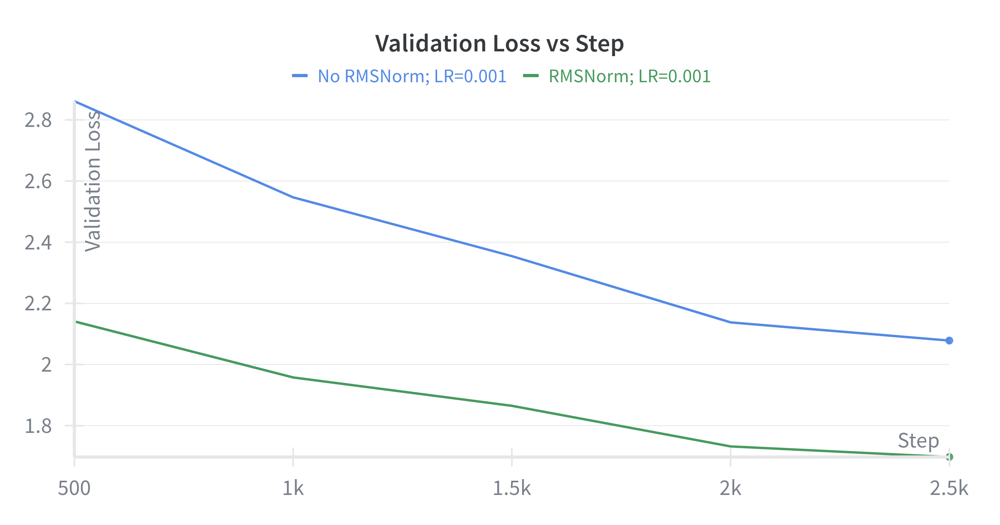
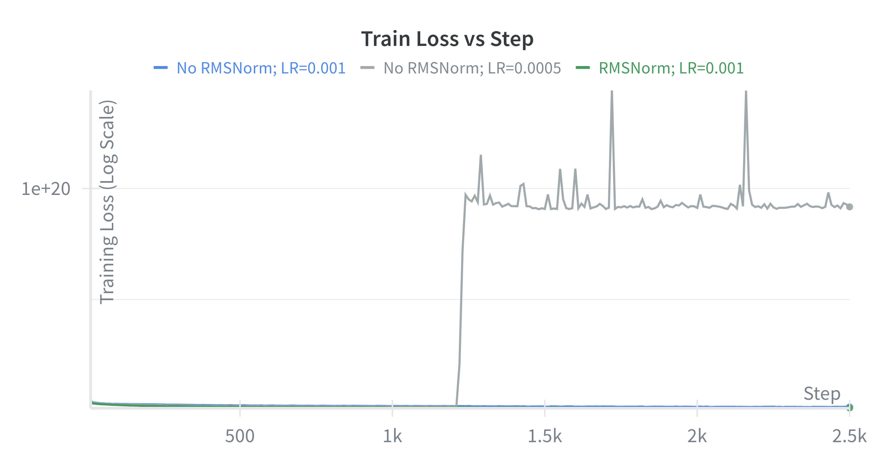
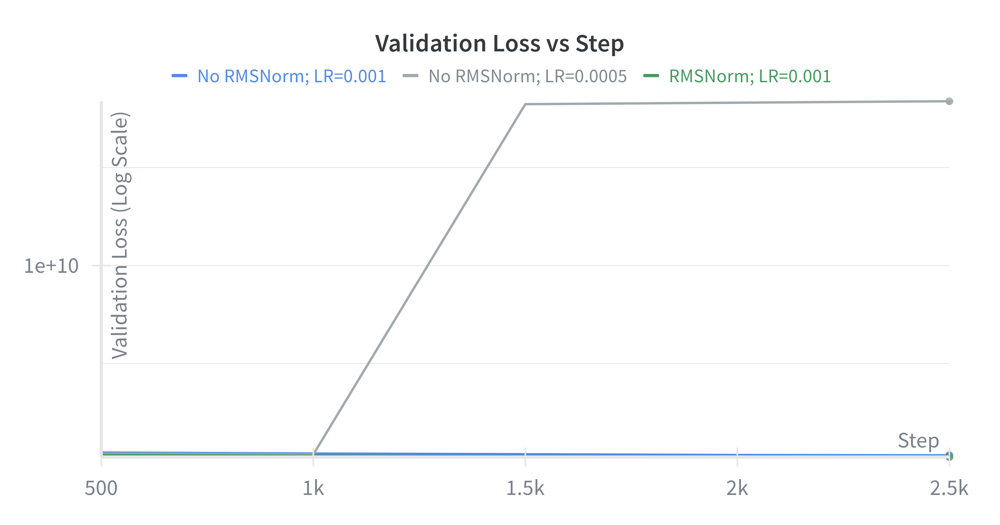

# Layer-norm Ablation

As can be observed from the training and validation losses in the plots above, RMSNorm plays a crucial role in the final performance of the model. Additionally, when we reduce the LR to 0.0005, we observe the following behaviour:

Interestingly, when LR=0.0005, at a certain point (around 1.25k step) our model's performance sharply degrades, and fails to recover from that point.
This further shows the importance of performing layer-wise normalization.
