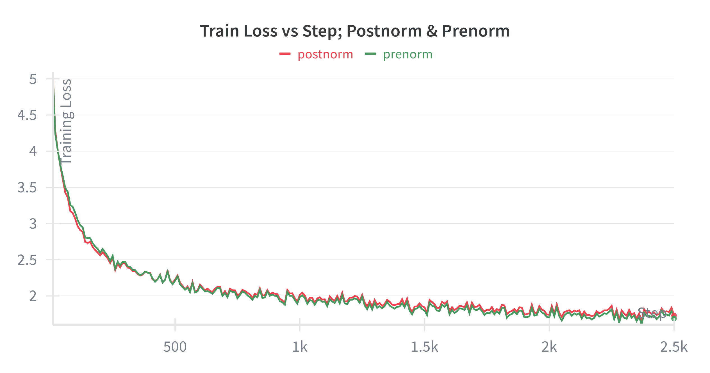
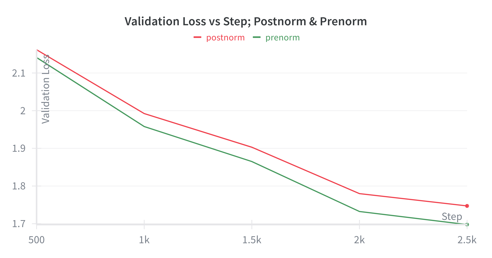

# Pre-norm vs Post-norm: Which is Better?

As can be observed in the plots above, although both perform very similarly in terms of training loss, the prenorm variant performs better for validation loss.

Although there is insufficient information to deduce the reason behind the better performance of pre-norm, there is an argument to be made for a cleaner residual signal to pass through each transformer block, in the pre-norm variant (i.e., the residual connection does not go through normalization for pre-norm). 