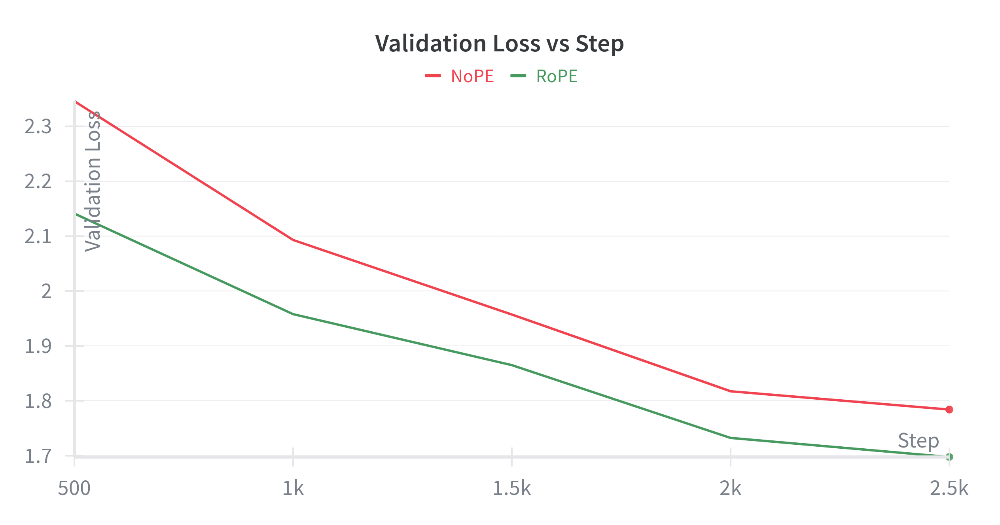

# Are Position Embeddings Important?

Although it may not look like it makes a big difference, that may be due to the nature of the dataset. 
The TinyStories dataset, which this ablation study was performed on, only consists of English stories. 
In this limited context, perhaps the importance of understanding relative positionings of words may not be too importance. 
For a larger, more varied dataset, where context may determine meanings of words, position embeddings may play an even larger role.