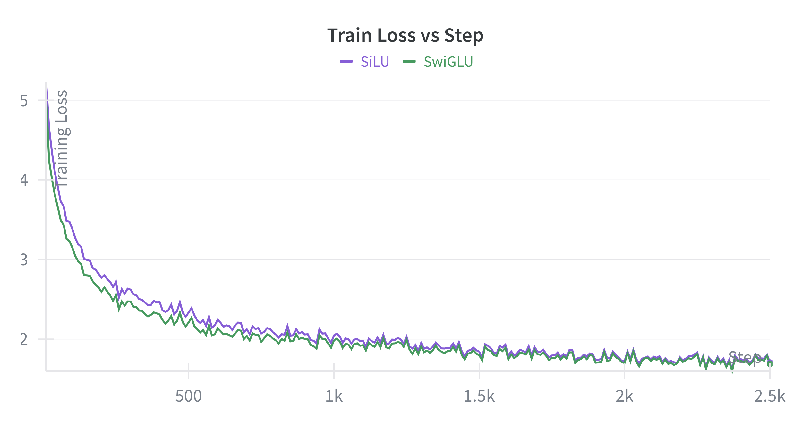
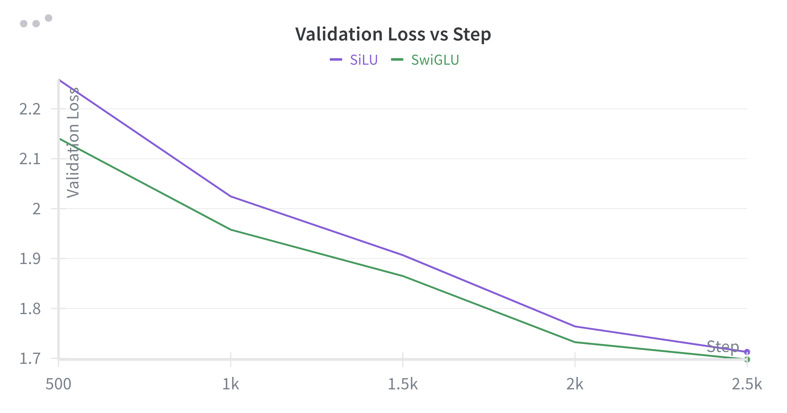

# SwiGLU vs SiLU: Is the Gating Linear Unit Important?

Despite SiLU and SwiGLU having similar representational capacity (i.e., similar number of trainable parameters), SwiGLU performs marginally better than SiLU. 
